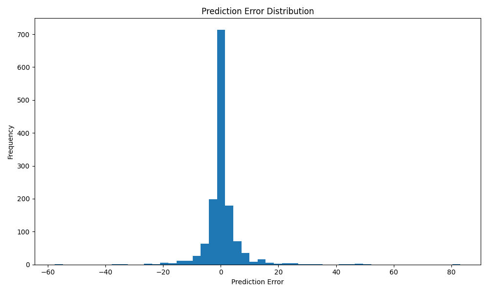
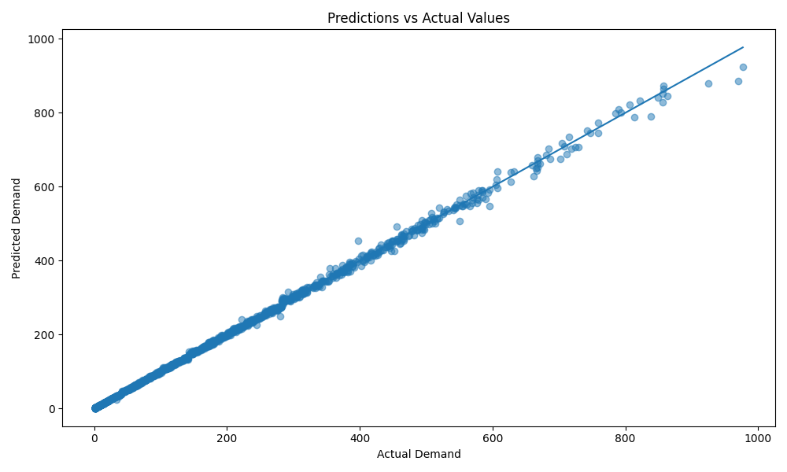

# error_analysis.py

## Project

```text
Bike_Sharing_Demand_Forecasting
```

---

# Overview

The `error_analysis.py` script is responsible for performing detailed forecasting error analysis for the Bike Sharing Demand Forecasting project.

This script evaluates the prediction quality of the best forecasting model:
```text
XGBoost
```

It performs:
- prediction error analysis,
- forecasting performance evaluation,
- error visualization,
- actual vs predicted comparison,
- and business-focused forecasting diagnostics.

The forecasting target is:

```text
cnt
```

which represents:
```text
Hourly bicycle rental demand
```

This analysis is extremely important because it helps determine:
- how reliable the forecasting model is,
- where prediction failures occur,
- and whether the model is suitable for operational deployment.

---

# File Location

```text
Bike_Sharing_Demand_Forecasting/
│
├── evaluation/
│   └── error_analysis.py
```

---

# Purpose

The purpose of this script is to:
- analyze forecasting prediction errors,
- evaluate operational reliability,
- identify forecasting weaknesses,
- and generate deployment-ready error reports.

This script supports:
- production monitoring,
- forecasting quality assessment,
- and operational planning validation.

---

# Input Files

The script expects:

## Test Dataset

```text
data/processed/test_dataset.csv
```

---

## Trained Forecasting Model

```text
models/xgboost_model.pkl
```

Generated from:

```bash
python training/train_xgboost.py
```

---

# Output Files

## Error Dataset

```text
reports/prediction_errors.csv
```

---

## Error Analysis Report

```text
reports/error_analysis_report.txt
```

---

## Error Distribution Plot

```text
graphs/error_distribution.png
```

---


## Prediction Comparison Plot

```text
graphs/prediction_vs_actual.png
```

---


# Workflow

```text
Load Test Dataset
        ↓
Load XGBoost Model
        ↓
Generate Predictions
        ↓
Calculate Forecast Errors
        ↓
Compute Evaluation Metrics
        ↓
Create Error Visualizations
        ↓
Generate Business Report
```

---

# Key Functionalities

---

# 1. XGBoost Validation

The script validates whether:

```text
xgboost
```

is installed.

If missing:

```bash
pip install xgboost
```

is displayed.

This improves:
- production stability,
- debugging experience,
- and deployment reliability.

---

# 2. Required File Validation

The script checks:
- test dataset availability,
- trained model existence,
- and forecasting pipeline integrity.

This prevents:
- deployment failures,
- missing model errors,
- and corrupted forecasting workflows.

---

# 3. Dataset Loading

The script loads:

```text
test_dataset.csv
```

using:

```python
pd.read_csv()
```

This dataset contains:
- unseen operational demand records,
- and forecasting evaluation data.

---

# 4. Feature & Target Separation

The dataset is divided into:

## Features

```python
X_test
```

## Target Variable

```python
y_test
```

Target:
```text
cnt
```

which represents:
```text
hourly bike demand
```

---

# 5. Model Loading

The script loads the trained XGBoost model using:

```python
joblib.load()
```

This validates:
- model serialization,
- deployment readiness,
- and inference compatibility.

---

# 6. Prediction Generation

Predictions are generated using:

```python
model.predict()
```

These predictions estimate:
```text
future bicycle rental demand
```

---

# 7. Error Calculation

The script calculates:

| Error Type | Description |
|---|---|
| Error | Actual - Predicted |
| Absolute Error | Magnitude of error |
| Percentage Error | Relative forecasting error |

---

# Error Formula

:contentReference[oaicite:0]{index=0}

Where:
- \(y\) = actual demand
- \(\hat{y}\) = predicted demand

---

# Absolute Error Formula

:contentReference[oaicite:1]{index=1}

Measures:
```text
prediction deviation magnitude
```

---

# Percentage Error Formula

:contentReference[oaicite:2]{index=2}

Measures:
```text
relative forecasting accuracy
```

---

# 8. Forecasting Evaluation Metrics

The script calculates:

| Metric | Description |
|---|---|
| MAE | Mean Absolute Error |
| RMSE | Root Mean Squared Error |
| R² | Variance Explained |

---

# MAE Formula

:contentReference[oaicite:3]{index=3}

Measures:
```text
average forecasting error
```

---

# RMSE Formula

:contentReference[oaicite:4]{index=4}

Penalizes:
```text
large forecasting mistakes
```

---

# R² Formula

:contentReference[oaicite:5]{index=5}

Measures:
```text
how well demand variation is explained
```

---

# 9. Error Dataset Generation

The script creates:

```text
prediction_errors.csv
```

Containing:
- actual demand,
- predicted demand,
- error values,
- absolute error,
- and percentage error.

This supports:
- operational diagnostics,
- forecasting debugging,
- and advanced analysis.

---

# 10. Error Distribution Visualization

The script generates:

```text
graphs/error_distribution.png
```

This histogram shows:
- forecasting error spread,
- prediction stability,
- and outlier behavior.

---

# Why Error Distribution Matters

A centered distribution around zero indicates:
```text
balanced forecasting performance
```

Large skewness or wide spread indicates:
- unstable predictions,
- forecasting bias,
- or operational inconsistencies.

---

# 11. Prediction vs Actual Visualization

The script generates:

```text
graphs/prediction_vs_actual.png
```

This plot compares:
- actual bike demand,
- and predicted bike demand.

---

# Ideal Forecast Behavior

Perfect forecasting follows:

:contentReference[oaicite:6]{index=6}

Points close to the diagonal indicate:
```text
high forecasting accuracy
```

---

# 12. Error Analysis Report

The script generates:

```text
reports/error_analysis_report.txt
```

The report includes:
- forecasting metrics,
- error statistics,
- operational insights,
- and deployment recommendations.

---

# Example Report

```text
MAE  : 21.37
RMSE : 31.52
R²   : 0.95

Business Insights:
- Forecast accuracy is strong.
- Peak demand periods show larger errors.
```

---

# 13. Operational Recommendations

The report suggests:

## Forecast Refresh Frequency

```text
Every 1–3 hours
```

because:
- weather conditions change rapidly,
- commuting behavior fluctuates,
- and operational demand varies throughout the day.

---

## Retraining Frequency

```text
Seasonal or monthly retraining
```

to adapt to:
- holidays,
- weather changes,
- and evolving customer demand.

---

# Production-Ready Design

The script follows production-quality software engineering practices.

## Maintainability
- modular sections,
- readable structure,
- descriptive naming.

## Reliability
- validation checks,
- safe model loading,
- exception handling.

## Scalability
- reusable evaluation pipeline,
- deployment-ready architecture,
- and extensible analysis framework.

## Collaboration Friendly
The codebase allows teammates to:
- debug forecasting systems,
- monitor operational performance,
- improve forecasting quality,
- and maintain deployment pipelines.

---

# Running the Script

From project root:

```bash
python evaluation/error_analysis.py
```

---

# Example Console Output

```text
========================================
 Performing Error Analysis
========================================

Predictions generated successfully.

MAE  : 21.37
RMSE : 31.52
R²   : 0.95

Error distribution plot saved.

Prediction plot saved.
```

---

# Business Importance

Error analysis is critical because businesses must understand:
- forecasting reliability,
- operational risk,
- and prediction stability.

This helps:
- improve logistics planning,
- reduce bicycle shortages,
- optimize staffing,
- and increase customer satisfaction.

---

# Operational Forecasting Impact

Detailed error analysis improves:
- demand forecasting trust,
- deployment confidence,
- operational monitoring,
- and forecasting system stability.

This directly supports:
```text
production-grade operational forecasting
```

---

# Why Error Analysis Matters

Even high-performing models can fail during:
- holidays,
- unusual weather,
- peak rush hours,
- and unexpected demand spikes.

Error analysis identifies:
- forecasting weaknesses,
- model limitations,
- and operational risk areas.

---

# Pipeline Position

```text
feature_engineering/
        ↓
model_training/
        ↓
evaluate_models.py
        ↓
error_analysis.py
        ↓
visualization/
        ↓
business_presentation/
        ↓
deployment/
```

---

# Next Recommended Step

After error analysis:

```bash
python visualization/plot_feature_importance.py
```

or continue with:
- forecasting visualization,
- business presentation,
- and deployment APIs.

---

# Summary

The `error_analysis.py` script performs detailed forecasting error analysis for the Bike Sharing Demand Forecasting project using the XGBoost model. It evaluates prediction quality, generates operational forecasting insights, creates error visualizations, and supports production-ready deployment decisions for bicycle demand planning and logistics optimization.