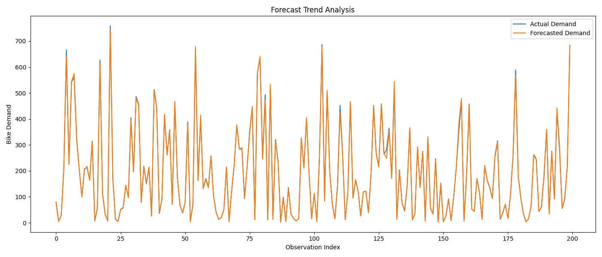
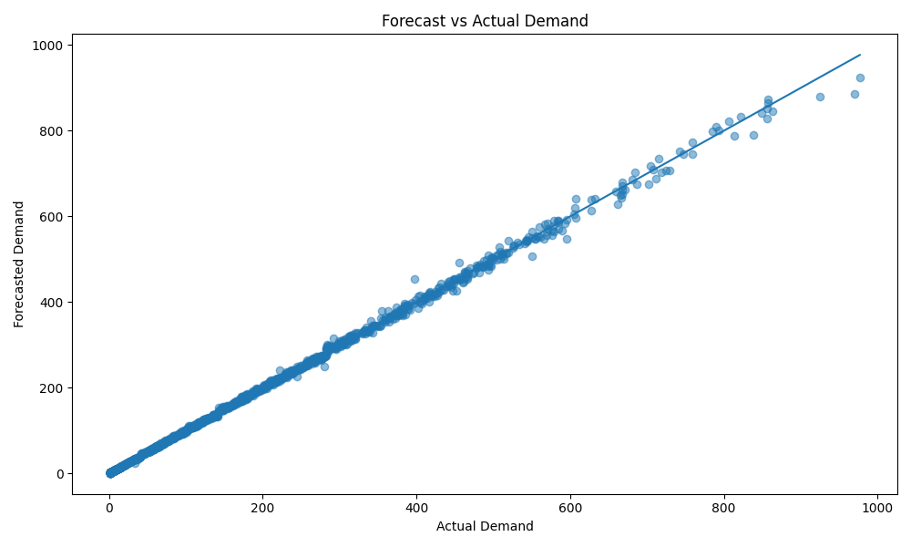

# forecast_analysis.py

## Project

```text
Bike_Sharing_Demand_Forecasting
```

---

# Overview

The `forecast_analysis.py` script performs advanced forecasting analysis for the Bike Sharing Demand Forecasting project.

This script evaluates how well the forecasting model predicts:
```text
hourly bicycle rental demand
```

using the trained:
```text
XGBoost forecasting model
```

The script performs:
- forecast generation,
- forecasting trend analysis,
- actual vs forecast comparison,
- forecasting error analysis,
- operational forecasting evaluation,
- and business-focused planning insights.

The forecasting target is:

```text
cnt
```

which represents:
```text
Hourly bike rental demand
```

This analysis helps businesses:
- optimize bicycle inventory,
- improve logistics planning,
- prepare for peak demand,
- and support operational forecasting decisions.

---

# File Location

```text
Bike_Sharing_Demand_Forecasting/
│
├── evaluation/
│   └── forecast_analysis.py
```

---

# Purpose

The purpose of this script is to:
- analyze forecast performance,
- evaluate operational forecasting quality,
- generate business insights,
- and support production deployment decisions.

This script supports:
- operational planning,
- logistics forecasting,
- workforce scheduling,
- and business forecasting systems.

---

# Input Files

The script expects:

## Test Dataset

```text
data/processed/test_dataset.csv
```

---

## Trained Forecasting Model

```text
models/xgboost_model.pkl
```

Generated from:

```bash
python training/train_xgboost.py
```

---

# Output Files

## Forecast Dataset

```text
reports/forecast_results.csv
```

---

## Forecast Analysis Report

```text
reports/forecast_analysis_report.txt
```

---

## Forecast Trend Visualization

```text
graphs/forecast_trend_analysis.png
```



---

## Forecast vs Actual Visualization

```text
graphs/forecast_vs_actual.png
```



---

# Workflow

```text
Load Test Dataset
        ↓
Load XGBoost Model
        ↓
Generate Forecasts
        ↓
Calculate Forecast Metrics
        ↓
Analyze Forecast Errors
        ↓
Create Forecast Visualizations
        ↓
Generate Business Report
```

---

# Key Functionalities

---

# 1. XGBoost Validation

The script verifies whether:

```text
xgboost
```

is installed.

If missing:

```bash
pip install xgboost
```

is displayed.

This improves:
- deployment reliability,
- debugging,
- and operational stability.

---

# 2. Required File Validation

The script validates:
- test dataset availability,
- trained model existence,
- and forecasting pipeline integrity.

This prevents:
- deployment failures,
- missing model errors,
- and broken forecasting workflows.

---

# 3. Dataset Loading

The script loads:

```text
test_dataset.csv
```

using:

```python
pd.read_csv()
```

This dataset contains:
- unseen operational data,
- and forecasting evaluation records.

---

# 4. Feature & Target Separation

The dataset is separated into:

## Features

```python
X_test
```

## Target Variable

```python
y_test
```

Target:
```text
cnt
```

which represents:
```text
hourly bike demand
```

---

# 5. Forecasting Model Loading

The script loads the trained XGBoost forecasting model using:

```python
joblib.load()
```

This validates:
- deployment readiness,
- inference compatibility,
- and forecasting stability.

---

# 6. Forecast Generation

Forecasts are generated using:

```python
model.predict()
```

These forecasts estimate:
```text
future hourly bicycle rental demand
```

---

# Forecasting Concept

Forecasting predicts future operational demand based on:
- historical demand patterns,
- weather conditions,
- time-based behavior,
- and seasonal trends.

---

# 7. Forecasting Evaluation Metrics

The script evaluates forecasting performance using:

| Metric | Description |
|---|---|
| MAE | Mean Absolute Error |
| RMSE | Root Mean Squared Error |
| R² | Variance Explained |

---

# MAE Formula

:contentReference[oaicite:0]{index=0}

Measures:
```text
average forecasting error
```

Lower MAE indicates:
```text
better forecasting accuracy
```

---

# RMSE Formula

:contentReference[oaicite:1]{index=1}

Penalizes:
```text
large forecasting errors
```

---

# R² Formula

:contentReference[oaicite:2]{index=2}

Measures:
```text
how well the model explains demand variation
```

---

# 8. Forecast DataFrame Creation

The script creates:

```text
forecast_results.csv
```

Containing:
- actual demand,
- forecasted demand,
- forecast error,
- absolute error,
- and percentage error.

This supports:
- forecasting diagnostics,
- operational monitoring,
- and advanced analysis.

---

# 9. Forecast Trend Visualization

The script generates:

```text
graphs/forecast_trend_analysis.png
```

This visualization compares:
- actual demand trends,
- and forecasted demand trends.

---

# Why Trend Analysis Matters

Trend analysis helps businesses:
- identify seasonal demand,
- monitor operational peaks,
- and detect forecasting instability.

---

# 10. Forecast vs Actual Visualization

The script generates:

```text
graphs/forecast_vs_actual.png
```

This scatter plot compares:
- actual bike demand,
- forecasted bike demand.

---

# Ideal Forecast Behavior

Perfect forecasting follows:

:contentReference[oaicite:3]{index=3}

Points close to the diagonal indicate:
```text
high forecasting accuracy
```

---

# 11. Forecast Analysis Report

The script generates:

```text
reports/forecast_analysis_report.txt
```

The report includes:
- forecasting metrics,
- operational insights,
- planning recommendations,
- and forecasting limitations.

---

# Example Forecast Report

```text
MAE  : 21.37
RMSE : 31.52
R²   : 0.95

Forecast Insights:
- Forecast accuracy is strong.
- Weather significantly impacts demand.
```

---

# 12. Operational Recommendations

The report recommends:

## Forecast Refresh Interval

```text
Every 1–3 hours
```

because:
- weather changes rapidly,
- commuting patterns fluctuate,
- and operational demand varies throughout the day.

---

## Forecast Planning Horizon

### Short-Term Forecasting

```text
1–7 days
```

provides:
```text
highest forecasting accuracy
```

---

### Medium-Term Forecasting

```text
1–4 weeks
```

is suitable for:
- operational planning,
- staffing,
- and inventory preparation.

---

### Long-Term Forecasting

Long-term forecasting requires:
- retraining,
- updated weather data,
- and seasonal recalibration.

---

# 13. Business Insights

The script identifies:
- seasonal demand behavior,
- peak-hour demand spikes,
- weather-driven variability,
- and operational forecasting patterns.

---

# Why Forecasting Matters

Accurate forecasting helps businesses:
- avoid bicycle shortages,
- optimize inventory,
- reduce operational costs,
- improve staffing efficiency,
- and increase customer satisfaction.

---

# Production-Ready Design

The script follows production-quality software engineering principles.

## Maintainability
- modular structure,
- readable formatting,
- descriptive naming.

## Reliability
- validation checks,
- exception handling,
- stable forecasting workflow.

## Scalability
- reusable forecasting pipeline,
- deployment-ready design,
- easy model upgrades.

## Collaboration Friendly
The codebase enables teammates to:
- monitor forecasting quality,
- retrain forecasting systems,
- improve model performance,
- and maintain deployment pipelines.

---

# Running the Script

From project root:

```bash
python evaluation/forecast_analysis.py
```

---

# Example Console Output

```text
========================================
 Performing Forecast Analysis
========================================

Forecasts generated successfully.

MAE  : 21.37
RMSE : 31.52
R²   : 0.95

Forecast trend plot saved.

Forecast comparison plot saved.
```

---

# Business Importance

Forecast analysis is critical for:
- operational planning,
- logistics forecasting,
- workforce scheduling,
- and inventory optimization.

This directly supports:
```text
production-grade forecasting systems
```

---

# Why XGBoost Is Suitable

XGBoost is recommended because it:
- captures nonlinear demand behavior,
- models seasonality effectively,
- handles weather dependencies,
- and delivers strong forecasting accuracy.

This makes it highly suitable for:
```text
business operational forecasting
```

---

# Operational Forecasting Impact

Accurate forecasting improves:
- bicycle availability,
- staffing efficiency,
- logistics planning,
- customer experience,
- and operational decision-making.

---

# Pipeline Position

```text
feature_engineering/
        ↓
model_training/
        ↓
train_xgboost.py
        ↓
evaluate_models.py
        ↓
forecast_analysis.py
        ↓
visualization/
        ↓
business_presentation/
        ↓
deployment/
```

---

# Next Recommended Step

After forecast analysis:

```bash
python visualization/plot_predictions.py
```

or continue with:
- feature importance visualization,
- business slide deck creation,
- dashboard development,
- and API deployment.

---

# Summary

The `forecast_analysis.py` script performs advanced forecasting evaluation for the Bike Sharing Demand Forecasting project using the XGBoost model. It generates operational forecasts, analyzes forecasting accuracy, creates business-focused visualizations, and provides deployment-ready insights for bicycle inventory planning and logistics optimization.