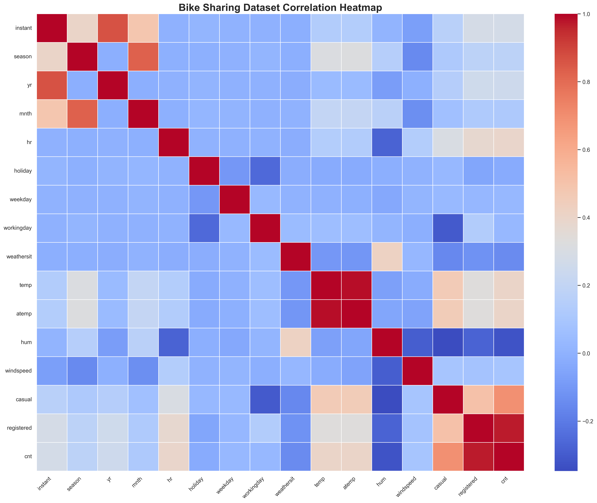

# generate_correlation_heatmap.py

## Project

```text
Bike_Sharing_Demand_Forecasting
```

---

# Overview

The `generate_correlation_heatmap.py` script generates a correlation heatmap visualization for the Bike Sharing Dataset.

This heatmap helps analyze:
- relationships between variables,
- feature importance,
- seasonal patterns,
- weather effects,
- and forecasting dependencies.

The script supports:
- Exploratory Data Analysis (EDA),
- feature selection,
- forecasting model development,
- and business reporting.

The generated output is:

```text
graphs/correlation_heatmap.png
```

---

# File Location

```text
Bike_Sharing_Demand_Forecasting/
│
├── visualization/
│   └── generate_correlation_heatmap.py
```

---

# Purpose

The purpose of this script is to:
- visualize feature correlations,
- identify forecasting drivers,
- detect multicollinearity,
- and support machine learning model optimization.

The script helps determine:
- which features strongly influence bike demand,
- which variables are redundant,
- and which features should be used for forecasting.

---

# Forecasting Target

The target variable is:

```text
cnt
```

which represents:

```text
Hourly Bike Rental Demand
```

---

# Why Correlation Analysis Matters

Correlation analysis helps:
- identify important predictors,
- reduce redundant variables,
- improve model accuracy,
- and support business forecasting decisions.

This improves:
- operational planning,
- inventory allocation,
- and forecasting reliability.

---

# Input Dataset

The script uses:

```text
data/raw/hour.csv
```

from the UCI Bike Sharing Dataset.

Dataset Source:

https://archive.ics.uci.edu/ml/datasets/Bike+Sharing+Dataset

---

# Output Generated

The script generates:

```text
graphs/correlation_heatmap.png
```

This image visualizes:
- positive correlations,
- negative correlations,
- and feature relationships.

---

# Folder Structure

```text
Bike_Sharing_Demand_Forecasting/
│
├── data/
│   └── raw/
│       └── hour.csv
│
├── graphs/
│   └── correlation_heatmap.png
│
├── visualization/
│   └── generate_correlation_heatmap.py
```

---

# Key Functionalities

---

# 1. Dataset Loading

## Purpose

Loads the Bike Sharing dataset into memory.

---

# Code Section

```python
df = pd.read_csv(DATA_PATH)
```

---

# Why It Matters

Provides access to:
- hourly rentals,
- weather features,
- seasonal indicators,
- and operational demand data.

---

# 2. Numeric Feature Selection

## Purpose

Selects only numeric columns for correlation analysis.

---

# Code Section

```python
numeric_df = df.select_dtypes(include=["number"])
```

---

# Why It Matters

Correlation calculations require numeric values.

This prevents:
- datatype errors,
- invalid correlations,
- and visualization failures.

---

# 3. Correlation Matrix Generation

## Purpose

Calculates feature-to-feature correlations.

---

# Code Section

```python
correlation_matrix = numeric_df.corr()
```

---

# Why It Matters

Shows:
- strong feature relationships,
- forecasting dependencies,
- and multicollinearity.

---

# 4. Heatmap Visualization

## Purpose

Visualizes the correlation matrix using a heatmap.

---

# Visualization Library

```text
Seaborn
```

---

# Code Section

```python
sns.heatmap(
    correlation_matrix,
    cmap="coolwarm"
)
```

---

# Why It Matters

Heatmaps provide:
- intuitive visual analysis,
- quick business insights,
- and forecasting interpretation.

---

# 5. Heatmap Export

## Purpose

Saves the generated heatmap as an image file.

---

# Output File

```text
graphs/correlation_heatmap.png
```



---

# Code Section

```python
plt.savefig(output_file, dpi=300)
```

---

# Why It Matters

Allows usage in:
- reports,
- business presentations,
- dashboards,
- and forecasting analysis.

---

# 6. Business Forecasting Insights

## Purpose

Displays forecasting-related observations.

---

# Example Insights

- Temperature positively affects demand.
- Humidity negatively affects rentals.
- Weather impacts operational demand.
- Seasonal trends strongly influence bike usage.

---

# Why It Matters

Supports:
- operational planning,
- business communication,
- and demand forecasting decisions.

---

# 7. Operational Recommendations

## Purpose

Provides production forecasting recommendations.

---

# Example Recommendations

- Refresh forecasts every 1–3 hours.
- Retrain models seasonally.
- Monitor weather-driven demand shifts.

---

# Why It Matters

Improves:
- forecasting stability,
- operational efficiency,
- and deployment reliability.

---

# Correlation Heatmap Interpretation

The heatmap uses colors to represent relationships.

---

# Color Meaning

| Color | Meaning |
|---|---|
| Red | Positive correlation |
| Blue | Negative correlation |
| White | Weak/no correlation |

---

# Strong Positive Correlation

Example:

```text
temp ↔ cnt
```

Meaning:
- higher temperatures increase bike rentals.

---

# Strong Negative Correlation

Example:

```text
hum ↔ cnt
```

Meaning:
- higher humidity reduces bike rentals.

---

# Business Insights from Heatmap

The heatmap helps identify:

- weather-sensitive demand,
- seasonal demand changes,
- commuting-hour demand spikes,
- and operational planning patterns.

---

# Key Features for Forecasting

Important forecasting variables include:

| Feature | Importance |
|---|---|
| temp | High |
| atemp | High |
| hum | Medium |
| weathersit | High |
| hr | Very High |
| season | High |
| workingday | Medium |

---

# Forecasting Importance

Feature correlations help:
- improve forecasting accuracy,
- reduce overfitting,
- and optimize feature engineering.

---

# Why Correlation Analysis Is Important

Without correlation analysis:
- redundant features may harm models,
- feature leakage may occur,
- and forecasting quality may decline.

Correlation analysis supports:
```text
production-grade forecasting systems
```

---

# Production-Ready Engineering Practices

The script includes:
- exception handling,
- automated directory creation,
- readable console logs,
- and modular architecture.

---

# Error Handling

The script handles:
- missing datasets,
- invalid file paths,
- and visualization failures.

---

# Why Error Handling Matters

Improves:
- operational reliability,
- deployment stability,
- and maintainability.

---

# Visualization Quality

The heatmap is saved using:

```python
dpi=300
```

This provides:
- high-resolution graphics,
- presentation-ready quality,
- and report-quality visualization.

---

# Running the Script

From project root:

```bash
python visualization/generate_correlation_heatmap.py
```

---

# Expected Console Output

```text
============================================================
 Loading Bike Sharing Dataset
============================================================

Dataset loaded successfully.

============================================================
 Generating Correlation Matrix
============================================================

Correlation matrix generated successfully.

============================================================
 Creating Correlation Heatmap
============================================================

Heatmap created successfully.

============================================================
 Saving Correlation Heatmap
============================================================

Heatmap saved successfully.
```

---

# Generated Output

```text
graphs/correlation_heatmap.png
```

---

# Required Libraries

## Data Processing

- pandas
- numpy

---

## Visualization

- matplotlib
- seaborn

---

# Install Dependencies

```bash
pip install pandas numpy matplotlib seaborn
```

---

# Example Business Use Cases

The heatmap can help businesses:
- optimize bicycle inventory,
- understand weather demand impact,
- improve staffing,
- and support logistics planning.

---

# Machine Learning Benefits

Correlation analysis improves:
- feature selection,
- model training,
- and forecasting performance.

---

# Future Improvements

Possible enhancements:
- interactive Plotly heatmaps,
- feature importance ranking,
- SHAP analysis,
- and automated EDA reporting.

---

# Summary

The `generate_correlation_heatmap.py` script generates a professional correlation heatmap for the Bike Sharing Dataset. It helps identify important forecasting features, understand demand drivers, analyze weather and seasonal relationships, and support machine learning forecasting development. The visualization improves exploratory data analysis, feature engineering, operational forecasting, and business decision-making.