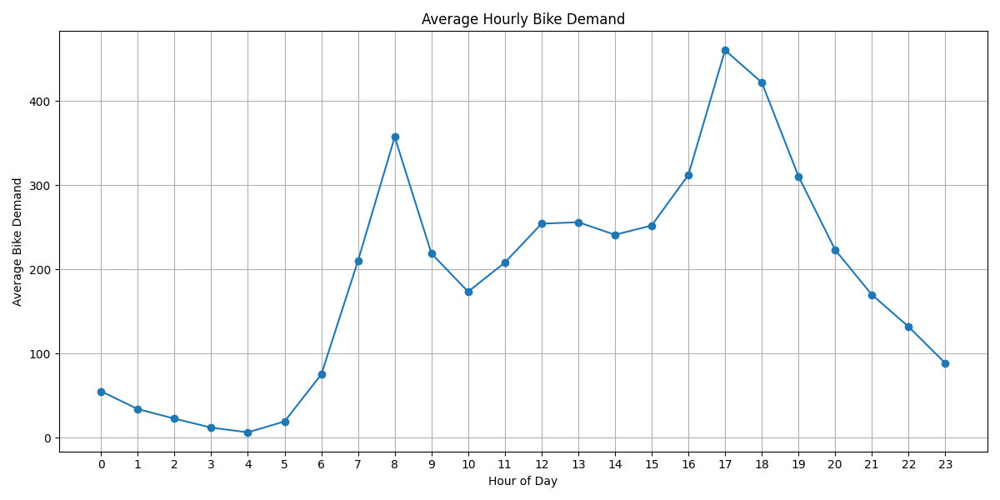
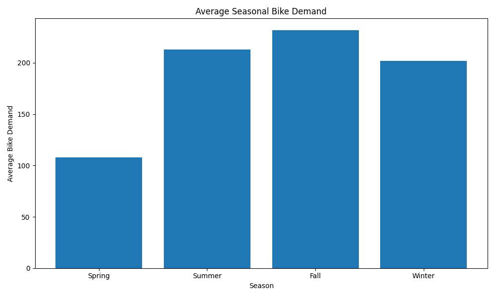
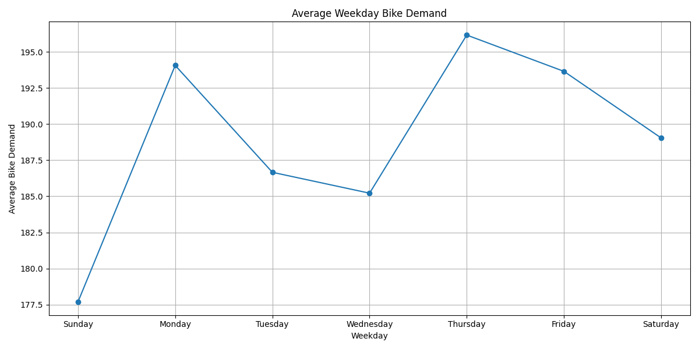
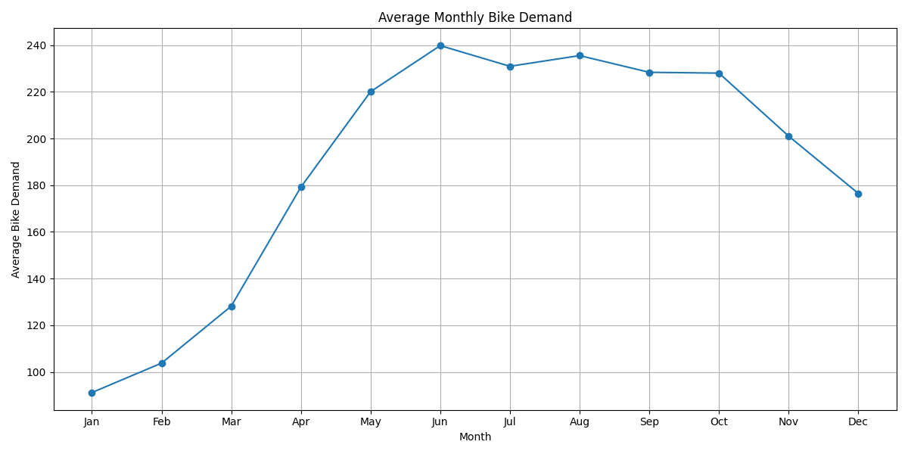

# plot_demand_trends.py

## Project

```text
Bike_Sharing_Demand_Forecasting
```

---

# Overview

The `plot_demand_trends.py` script is responsible for generating demand trend visualizations for the Bike Sharing Demand Forecasting project.

This script performs exploratory demand analysis by visualizing:
- hourly bike demand,
- seasonal demand trends,
- weekday rental behavior,
- and monthly demand patterns.

These visualizations help businesses:
- understand customer behavior,
- identify peak rental periods,
- optimize bicycle allocation,
- and improve operational forecasting.

The forecasting target is:

```text
cnt
```

which represents:
```text
Hourly bicycle rental demand
```

This script is an important part of:
```text
Exploratory Data Analysis (EDA)
```

and business-focused forecasting analysis.

---

# File Location

```text
Bike_Sharing_Demand_Forecasting/
│
├── visualization/
│   └── plot_demand_trends.py
```

---

# Purpose

The purpose of this script is to:
- analyze bicycle demand behavior,
- generate business-ready visualizations,
- identify seasonal patterns,
- and support operational forecasting decisions.

This script supports:
- exploratory data analysis,
- business reporting,
- operational planning,
- and forecasting presentations.

---

# Input File

The script expects:

```text
data/processed/feature_engineered_data.csv
```

Generated from:

```bash
python feature_engineering/create_time_features.py
```

---

# Output Graphs

The script generates the following visualizations:

| Graph | File |
|---|---|
| Hourly Demand Trend | graphs/hourly_demand.png |
| Seasonal Demand Trend | graphs/seasonal_trends.png |
| Weekday Demand Trend | graphs/weekday_demand_trends.png |
| Monthly Demand Trend | graphs/monthly_demand_trends.png |

---

# Workflow

```text
Load Feature Engineered Dataset
        ↓
Validate Required Columns
        ↓
Generate Hourly Demand Trend
        ↓
Generate Seasonal Trend
        ↓
Generate Weekday Trend
        ↓
Generate Monthly Trend
        ↓
Save Visualization Graphs
```

---

# Key Functionalities

---

# 1. Dataset Validation

The script validates:
- dataset availability,
- required forecasting columns,
- and visualization compatibility.

Required columns include:

| Column | Purpose |
|---|---|
| hr | Hour of day |
| cnt | Bike demand |
| season | Seasonal grouping |
| weekday | Day of week |
| mnth | Month |

This prevents:
- visualization failures,
- corrupted graphs,
- and invalid forecasting analysis.

---

# 2. Dataset Loading

The script loads:

```text
feature_engineered_data.csv
```

using:

```python
pd.read_csv()
```

This dataset contains:
- cleaned bike rental records,
- engineered time features,
- and forecasting variables.

---

# 3. Hourly Demand Trend Visualization

The script generates:

```text
graphs/hourly_demand.png
```



This graph visualizes:
```text
average bike demand by hour
```

---

# Hourly Demand Insights

The graph helps identify:
- commuting peaks,
- rush-hour demand,
- and low-demand periods.

Typical operational observations:
- morning rush hour,
- evening commuting peaks,
- reduced nighttime demand.

---

# Hourly Demand Formula

The hourly demand trend uses:

:contentReference[oaicite:0]{index=0}

Where:
- \(cnt\) = bike rentals
- \(N\) = number of records

---

# 4. Seasonal Demand Trend Visualization

The script generates:

```text
graphs/seasonal_trends.png
```



This graph visualizes:
```text
average bike demand by season
```

---

# Seasonal Insights

The graph helps identify:
- high-demand seasons,
- weather-driven demand,
- and operational planning needs.

Typical observations:
- higher summer demand,
- increased fall rentals,
- lower winter usage.

---

# Seasonal Business Importance

Seasonality impacts:
- bicycle inventory,
- staffing,
- maintenance scheduling,
- and logistics planning.

---

# 5. Weekday Demand Trend Visualization

The script generates:

```text
graphs/weekday_demand_trends.png
```



This graph visualizes:
```text
average demand across weekdays
```

---

# Weekday Insights

The graph helps identify:
- commuter behavior,
- weekday traffic,
- and weekend demand patterns.

Typical observations:
- higher weekday commuting demand,
- lower weekend office travel,
- recreational weekend usage.

---

# 6. Monthly Demand Trend Visualization

The script generates:

```text
graphs/monthly_demand_trends.png
```



This graph visualizes:
```text
average monthly bike demand
```

---

# Monthly Insights

The graph helps businesses:
- identify long-term trends,
- monitor seasonal transitions,
- and improve annual forecasting.

---

# 7. Business Insights Section

The script automatically displays:
- key demand observations,
- operational insights,
- and forecasting recommendations.

Example insights:
- Peak demand occurs during commuting hours
- Summer demand is higher
- Weather strongly affects rentals

---

# 8. Operational Recommendations

The script recommends:

## Forecast Refresh Frequency

```text
Every 1–3 hours
```

because:
- demand changes dynamically,
- commuting patterns fluctuate,
- and weather affects operations.

---

## Inventory Optimization

The visualizations help businesses:
- allocate bicycles efficiently,
- reduce shortages,
- and improve customer satisfaction.

---

# Production-Ready Design

The script follows production-quality software engineering practices.

## Maintainability
- modular sections,
- readable structure,
- descriptive naming.

## Reliability
- dataset validation,
- exception handling,
- stable plotting workflow.

## Scalability
- reusable visualization pipeline,
- future graph expansion,
- dashboard compatibility.

## Collaboration Friendly
The codebase enables teammates to:
- create reports,
- analyze trends,
- improve forecasting insights,
- and maintain operational dashboards.

---

# Running the Script

From project root:

```bash
python visualization/plot_demand_trends.py
```

---

# Example Console Output

```text
========================================
 Plotting Demand Trends
========================================

Dataset loaded successfully.

Hourly demand plot saved.

Seasonal trend plot saved.

Weekday trend plot saved.

Monthly trend plot saved.
```

---

# Business Importance

Demand trend visualization is critical for:
- operational planning,
- staffing allocation,
- inventory optimization,
- and forecasting strategy.

These visualizations help businesses:
- understand customer behavior,
- improve logistics,
- and prepare for peak demand.

---

# Forecasting Importance

Trend analysis improves:
- forecasting quality,
- seasonal planning,
- demand understanding,
- and operational readiness.

This directly supports:
```text
production-grade bike demand forecasting
```

---

# Why Demand Visualization Matters

Without visualization:
- forecasting insights are difficult to interpret,
- seasonal trends may be missed,
- and operational planning becomes weaker.

Visualization enables:
- better business communication,
- improved decision-making,
- and operational optimization.

---

# Pipeline Position

```text
data_ingestion/
        ↓
feature_engineering/
        ↓
model_training/
        ↓
evaluation/
        ↓
plot_demand_trends.py
        ↓
business_presentation/
        ↓
deployment/
```

---

# Next Recommended Step

After generating demand trends:

```bash
python visualization/plot_feature_importance.py
```

or continue with:
- prediction visualization,
- error analysis plotting,
- business presentation,
- and dashboard development.

---

# Summary

The `plot_demand_trends.py` script generates exploratory demand visualizations for the Bike Sharing Demand Forecasting project. It analyzes hourly, seasonal, weekday, and monthly bike rental behavior to support operational forecasting, logistics planning, inventory optimization, and business decision-making.