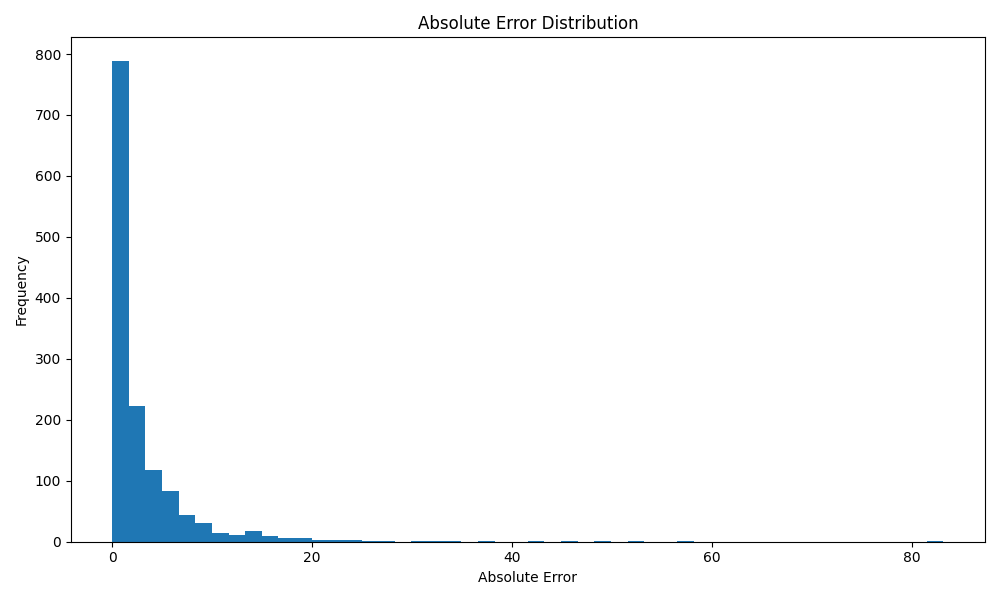
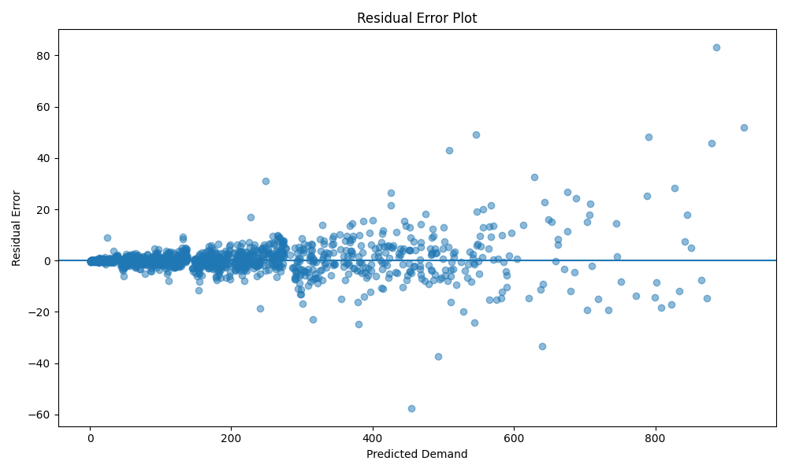
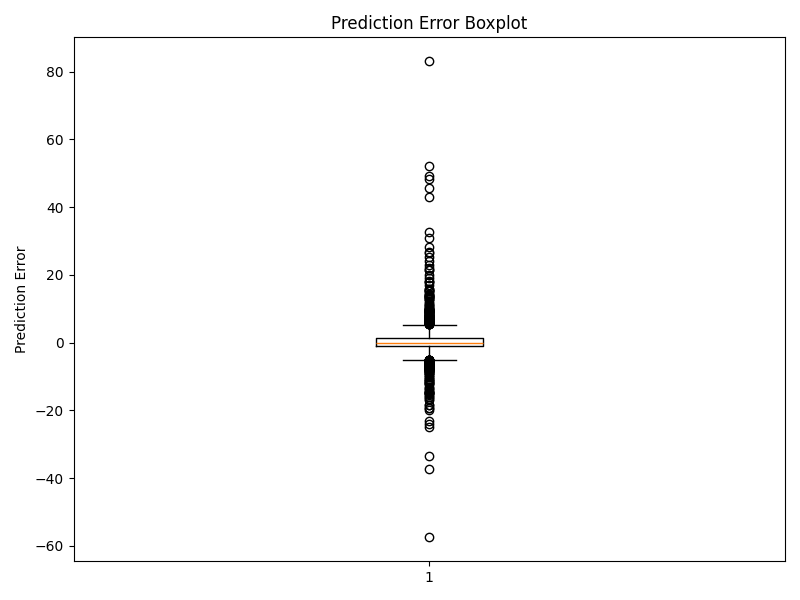

# plot_error_distribution.py

## Project

```text
Bike_Sharing_Demand_Forecasting
```

---

# Overview

The `plot_error_distribution.py` script is responsible for generating forecasting error analysis visualizations for the Bike Sharing Demand Forecasting project.

This script analyzes prediction errors produced by the trained:
```text
XGBoost forecasting model
```

The script performs:
- prediction error analysis,
- residual error visualization,
- error distribution analysis,
- absolute error analysis,
- and operational forecasting diagnostics.

The forecasting target is:

```text
cnt
```

which represents:
```text
Hourly bicycle rental demand
```

These visualizations help businesses:
- understand forecasting reliability,
- identify operational forecasting risks,
- monitor prediction stability,
- and validate production readiness.

---

# File Location

```text
Bike_Sharing_Demand_Forecasting/
│
├── visualization/
│   └── plot_error_distribution.py
```

---

# Purpose

The purpose of this script is to:
- analyze forecasting prediction errors,
- visualize forecasting stability,
- identify operational forecasting weaknesses,
- and support production-grade deployment monitoring.

This script supports:
- forecasting diagnostics,
- operational reliability analysis,
- business reporting,
- and deployment validation.

---

# Input Files

The script expects:

## Test Dataset

```text
data/processed/test_dataset.csv
```

---

## Trained Forecasting Model

```text
models/xgboost_model.pkl
```

Generated from:

```bash
python training/train_xgboost.py
```

---

# Output Files

## Error Analysis Dataset

```text
reports/prediction_error_analysis.csv
```

---

## Error Distribution Histogram

```text
graphs/error_distribution.png
```

---

## Absolute Error Distribution

```text
graphs/absolute_error_distribution.png
```

---

## Residual Error Plot

```text
graphs/residual_error_plot.png
```

---

## Error Boxplot

```text
graphs/error_boxplot.png
```

---

# Workflow

```text
Load Test Dataset
        ↓
Load XGBoost Model
        ↓
Generate Predictions
        ↓
Calculate Prediction Errors
        ↓
Compute Forecast Metrics
        ↓
Create Error Analysis Dataset
        ↓
Generate Error Visualizations
        ↓
Save Reports & Graphs
```

---

# Key Functionalities

---

# 1. XGBoost Validation

The script validates whether:

```text
xgboost
```

is installed.

If missing:

```bash
pip install xgboost
```

is displayed.

This improves:
- deployment reliability,
- debugging,
- and operational stability.

---

# 2. Required File Validation

The script validates:
- test dataset availability,
- trained model existence,
- and forecasting pipeline integrity.

This prevents:
- visualization failures,
- missing model errors,
- and broken forecasting workflows.

---

# 3. Dataset Loading

The script loads:

```text
test_dataset.csv
```

using:

```python
pd.read_csv()
```

This dataset contains:
- unseen forecasting records,
- operational demand observations,
- and evaluation data.

---

# 4. Feature & Target Separation

The dataset is separated into:

## Features

```python
X_test
```

## Target Variable

```python
y_test
```

Target:
```text
cnt
```

which represents:
```text
hourly bike demand
```

---

# 5. Forecasting Model Loading

The script loads the trained XGBoost model using:

```python
joblib.load()
```

This validates:
- deployment readiness,
- model compatibility,
- and operational forecasting stability.

---

# 6. Prediction Generation

Predictions are generated using:

```python
model.predict()
```

These forecasts estimate:
```text
future bicycle rental demand
```

---

# Forecasting Concept

Forecasting predicts future demand using:
- historical rental behavior,
- weather conditions,
- time-based patterns,
- and seasonal trends.

---

# 7. Prediction Error Calculation

The script calculates:

| Error Type | Description |
|---|---|
| Prediction Error | Actual - Predicted |
| Absolute Error | Magnitude of error |
| Squared Error | Error squared |
| Percentage Error | Relative forecasting error |

---

# Prediction Error Formula

:contentReference[oaicite:0]{index=0}

Where:
- \(y\) = actual demand
- \(\hat{y}\) = predicted demand

---

# Absolute Error Formula

:contentReference[oaicite:1]{index=1}

Measures:
```text
prediction deviation magnitude
```

---

# Squared Error Formula

:contentReference[oaicite:2]{index=2}

Penalizes:
```text
large forecasting mistakes
```

---

# Percentage Error Formula

:contentReference[oaicite:3]{index=3}

Measures:
```text
relative forecasting accuracy
```

---

# 8. Forecasting Evaluation Metrics

The script calculates:

| Metric | Description |
|---|---|
| MAE | Mean Absolute Error |
| RMSE | Root Mean Squared Error |
| R² | Variance Explained |

---

# MAE Formula

:contentReference[oaicite:4]{index=4}

Measures:
```text
average forecasting error
```

---

# RMSE Formula

:contentReference[oaicite:5]{index=5}

Measures:
```text
forecasting stability
```

---

# R² Formula

:contentReference[oaicite:6]{index=6}

Measures:
```text
how well the model explains demand variation
```

---

# 9. Error Analysis Dataset

The script generates:

```text
reports/prediction_error_analysis.csv
```

Containing:
- actual demand,
- predicted demand,
- prediction error,
- absolute error,
- squared error,
- and percentage error.

This supports:
- operational diagnostics,
- forecasting monitoring,
- and advanced analysis.

---

# 10. Error Distribution Histogram

The script generates:

```text
graphs/error_distribution.png
```


This histogram visualizes:
```text
the spread of forecasting errors
```

---

# Why Error Distribution Matters

A balanced distribution centered around zero indicates:
```text
stable forecasting performance
```

Large spread indicates:
- unstable predictions,
- forecasting volatility,
- or operational forecasting risk.

---

# 11. Absolute Error Distribution

The script generates:

```text
graphs/absolute_error_distribution.png
```



This graph visualizes:
```text
the magnitude of forecasting errors
```

This helps identify:
- operational forecasting reliability,
- and high-error forecasting periods.

---

# 12. Residual Error Plot

The script generates:

```text
graphs/residual_error_plot.png
```



Residuals represent:

:contentReference[oaicite:7]{index=7}

This plot helps identify:
- prediction bias,
- systematic forecasting errors,
- and operational instability.

---

# Why Residual Analysis Matters

Good forecasting systems produce:
```text
randomly distributed residuals
```

Patterns may indicate:
- model bias,
- missing variables,
- or forecasting weaknesses.

---

# 13. Error Boxplot

The script generates:

```text
graphs/error_boxplot.png
```



This visualization identifies:
- outliers,
- forecasting spread,
- and operational anomalies.

---

# Why Boxplots Matter

Boxplots help businesses:
- identify extreme forecasting errors,
- monitor operational risk,
- and improve forecasting quality.

---

# 14. Error Statistics

The script calculates:
- average error,
- maximum error,
- minimum error,
- average absolute error,
- and average percentage error.

These metrics help businesses:
- evaluate forecasting stability,
- assess operational risk,
- and validate deployment readiness.

---

# 15. Business Insights

The script automatically displays:
- forecasting observations,
- operational insights,
- and deployment recommendations.

Example insights:
- Most prediction errors are centered around zero
- Peak-hour demand contributes to larger residuals
- Weather variability affects forecasting stability

---

# 16. Operational Recommendations

The script recommends:

## Forecast Refresh Frequency

```text
Every 1–3 hours
```

because:
- demand changes dynamically,
- weather conditions fluctuate,
- and operational behavior evolves rapidly.

---

## Forecast Monitoring

Businesses should:
- monitor high-error periods,
- track seasonal forecasting drift,
- and retrain models regularly.

---

# Business Importance

Error visualization is critical for:
- operational trust,
- deployment validation,
- forecasting transparency,
- and production monitoring.

These visualizations help businesses:
- understand forecasting weaknesses,
- improve operational planning,
- and reduce forecasting risk.

---

# Why Error Analysis Matters

Even accurate models can fail during:
- holidays,
- severe weather,
- rush hours,
- and unusual operational events.

Error analysis identifies:
- forecasting weaknesses,
- operational instability,
- and deployment risks.

---

# Production-Ready Design

The script follows production-quality software engineering practices.

## Maintainability
- modular structure,
- readable formatting,
- descriptive naming.

## Reliability
- validation checks,
- exception handling,
- stable visualization workflow.

## Scalability
- reusable analysis pipeline,
- dashboard integration support,
- future forecasting expansion.

## Collaboration Friendly
The codebase allows teammates to:
- monitor forecasting quality,
- debug operational issues,
- improve forecasting systems,
- and maintain production pipelines.

---

# Running the Script

From project root:

```bash
python visualization/plot_error_distribution.py
```

---

# Example Console Output

```text
========================================
 Plotting Error Distribution
========================================

Predictions generated successfully.

MAE  : 21.37
RMSE : 31.52
R²   : 0.95

Error distribution plot saved.

Residual error plot saved.
```

---

# Why XGBoost Is Suitable

XGBoost is recommended because it:
- captures nonlinear demand patterns,
- models weather dependencies,
- handles seasonality effectively,
- and provides strong forecasting accuracy.

This makes it ideal for:
```text
business operational forecasting
```

---

# Operational Forecasting Impact

Error analysis improves:
- bicycle inventory planning,
- staffing optimization,
- operational reliability,
- and customer satisfaction.

This directly supports:
```text
production-grade forecasting systems
```

---

# Pipeline Position

```text
feature_engineering/
        ↓
model_training/
        ↓
train_xgboost.py
        ↓
evaluate_models.py
        ↓
plot_error_distribution.py
        ↓
business_presentation/
        ↓
deployment/
```

---

# Next Recommended Step

After error visualization:

```bash
python app/app.py
```

or continue with:
- dashboard development,
- API deployment,
- business presentation creation,
- and production monitoring.

---

# Summary

The `plot_error_distribution.py` script performs forecasting error visualization and operational error analysis for the Bike Sharing Demand Forecasting project using the XGBoost model. It analyzes prediction stability, visualizes forecasting errors, identifies operational forecasting risks, and supports production-ready deployment validation for business forecasting systems.