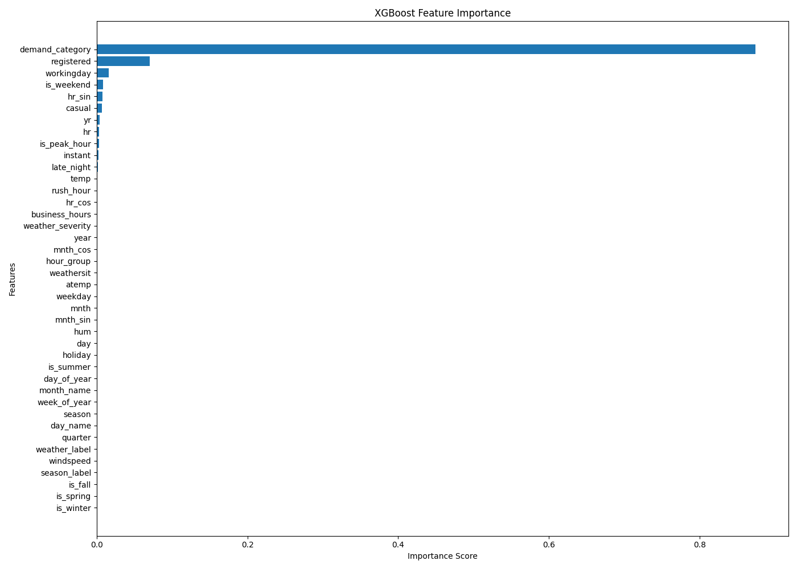
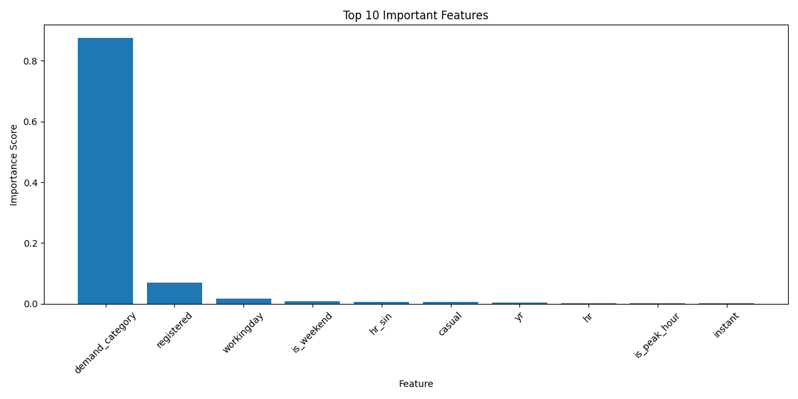

# plot_feature_importance.py

## Project

```text
Bike_Sharing_Demand_Forecasting
```

---

# Overview

The `plot_feature_importance.py` script is responsible for generating feature importance visualizations for the Bike Sharing Demand Forecasting project.

This script analyzes which features contribute the most to forecasting:
```text
hourly bicycle rental demand
```

using the trained:
```text
XGBoost forecasting model
```

The script performs:
- feature importance extraction,
- feature ranking,
- forecasting driver analysis,
- visualization generation,
- and business-focused operational insights.

The forecasting target is:

```text
cnt
```

which represents:
```text
Hourly bicycle rental demand
```

Feature importance analysis helps businesses:
- understand forecasting behavior,
- identify demand drivers,
- improve operational planning,
- and optimize decision-making.

---

# File Location

```text
Bike_Sharing_Demand_Forecasting/
│
├── visualization/
│   └── plot_feature_importance.py
```

---

# Purpose

The purpose of this script is to:
- identify important forecasting variables,
- visualize model decision factors,
- analyze operational demand drivers,
- and support business forecasting interpretation.

This script supports:
- explainable AI,
- operational forecasting,
- business reporting,
- and forecasting transparency.

---

# Input Files

The script expects:

## Training Dataset

```text
data/processed/train_dataset.csv
```

---

## Trained Forecasting Model

```text
models/xgboost_model.pkl
```

Generated from:

```bash
python training/train_xgboost.py
```

---

# Output Files

## Feature Importance CSV

```text
reports/xgboost_feature_importance.csv
```

---

## Complete Feature Importance Plot

```text
graphs/feature_importance.png
```

---

## Top 10 Features Plot

```text
graphs/top_10_features.png
```

---

# Workflow

```text
Load Training Dataset
        ↓
Load XGBoost Model
        ↓
Extract Feature Importance
        ↓
Rank Features
        ↓
Generate Visualizations
        ↓
Save Reports & Graphs
```

---

# Key Functionalities

---

# 1. XGBoost Validation

The script validates whether:

```text
xgboost
```

is installed.

If missing:

```bash
pip install xgboost
```

is displayed.

This improves:
- deployment reliability,
- debugging,
- and operational stability.

---

# 2. Required File Validation

The script checks:
- training dataset availability,
- trained model existence,
- and visualization pipeline integrity.

This prevents:
- plotting failures,
- corrupted analysis,
- and deployment issues.

---

# 3. Dataset Loading

The script loads:

```text
train_dataset.csv
```

using:

```python
pd.read_csv()
```

This dataset contains:
- processed forecasting features,
- operational variables,
- and historical bike demand records.

---

# 4. Feature Separation

The script separates:

## Features

```python
X_train
```

from:

## Target Variable

```python
cnt
```

This enables:
```text
feature importance extraction
```

from the trained forecasting model.

---

# 5. XGBoost Model Loading

The trained forecasting model is loaded using:

```python
joblib.load()
```

This validates:
- model serialization,
- deployment readiness,
- and forecasting compatibility.

---

# 6. Feature Importance Extraction

The script extracts importance values using:

```python
model.feature_importances_
```

This identifies:
- which variables most influence bike demand,
- and which features drive forecasting performance.

---

# Feature Importance Concept

Feature importance measures:
```text
how much a feature contributes to prediction accuracy
```

Higher importance indicates:
```text
stronger forecasting influence
```

---

# XGBoost Feature Importance Formula

Feature importance is derived from:
- information gain,
- split improvement,
- and reduction in forecasting error.

Gradient boosting prediction update:

:contentReference[oaicite:0]{index=0}

Where:
- \(F_m(x)\) = updated prediction
- \(h_m(x)\) = decision tree learner
- \(\gamma_m\) = learning contribution

---

# 7. Feature Importance CSV Export

The script generates:

```text
xgboost_feature_importance.csv
```

Containing:
- feature names,
- importance scores,
- and ranked forecasting variables.

This supports:
- reporting,
- dashboard creation,
- and business interpretation.

---

# Example Output

| Feature | Importance |
|---|---|
| hr | 0.28 |
| temp | 0.19 |
| workingday | 0.12 |

---

# 8. Complete Feature Importance Visualization

The script generates:

```text
graphs/feature_importance.png
```



This visualization displays:
```text
importance scores for all forecasting features
```

---

# Why Feature Importance Matters

Feature importance helps businesses:
- understand demand behavior,
- identify operational drivers,
- and improve planning decisions.

---

# 9. Top 10 Feature Visualization

The script generates:

```text
graphs/top_10_features.png
```



This graph highlights:
```text
the most influential forecasting variables
```

This simplifies:
- business presentations,
- operational reporting,
- and executive communication.

---

# 10. Business Insights Generation

The script automatically displays:
- top forecasting drivers,
- operational observations,
- and demand insights.

Example insights:
- Rush-hour demand strongly affects rentals
- Weather impacts forecasting accuracy
- Seasonal features improve prediction quality

---

# 11. Operational Recommendations

The script recommends:

## Forecast Monitoring

```text
Monitor top forecasting variables regularly
```

because:
- weather changes rapidly,
- commuting patterns shift,
- and seasonal demand fluctuates.

---

## Model Retraining

```text
Retrain models seasonally
```

to adapt to:
- weather variation,
- customer behavior,
- and operational demand changes.

---

# Business Importance of Top Features

Important variables often include:

| Feature | Business Meaning |
|---|---|
| hr | Rush-hour demand |
| temp | Weather-driven demand |
| season | Seasonal rental patterns |
| workingday | Commuter activity |

These insights help:
- optimize bicycle inventory,
- improve staffing,
- and enhance operational planning.

---

# Production-Ready Design

The script follows production-quality software engineering practices.

## Maintainability
- modular structure,
- readable formatting,
- descriptive naming.

## Reliability
- validation checks,
- safe model loading,
- stable visualization workflow.

## Scalability
- reusable visualization pipeline,
- future feature expansion,
- dashboard integration support.

## Collaboration Friendly
The codebase enables teammates to:
- analyze forecasting drivers,
- explain model behavior,
- improve forecasting quality,
- and maintain production systems.

---

# Running the Script

From project root:

```bash
python visualization/plot_feature_importance.py
```

---

# Example Console Output

```text
========================================
 Plotting Feature Importance
========================================

Feature importance extracted successfully.

Feature importance plot saved.

Top feature plot saved.
```

---

# Business Importance

Feature importance analysis is critical for:
- explainable forecasting,
- operational transparency,
- and business decision-making.

It helps businesses:
- understand forecasting behavior,
- trust machine learning outputs,
- and improve operational strategies.

---

# Why Explainable Forecasting Matters

Businesses often require:
```text
interpretable forecasting systems
```

Feature importance explains:
- why demand changes,
- what drives predictions,
- and which variables impact operations most.

---

# Operational Forecasting Impact

Feature analysis improves:
- bicycle allocation,
- staffing decisions,
- weather preparedness,
- and seasonal planning.

This directly supports:
```text
production-grade operational forecasting
```

---

# Why XGBoost Is Valuable

XGBoost provides:
- high forecasting accuracy,
- strong nonlinear modeling,
- and built-in feature importance analysis.

This makes it ideal for:
```text
business demand forecasting systems
```

---

# Pipeline Position

```text
feature_engineering/
        ↓
model_training/
        ↓
train_xgboost.py
        ↓
plot_feature_importance.py
        ↓
business_presentation/
        ↓
deployment/
```

---

# Next Recommended Step

After feature importance visualization:

```bash
python visualization/plot_predictions.py
```

or continue with:
- forecasting dashboards,
- business slide deck creation,
- and API deployment.

---

# Summary

The `plot_feature_importance.py` script analyzes and visualizes forecasting feature importance for the Bike Sharing Demand Forecasting project using the XGBoost model. It identifies key operational demand drivers, generates explainable forecasting insights, and supports business-focused operational planning and production forecasting systems.