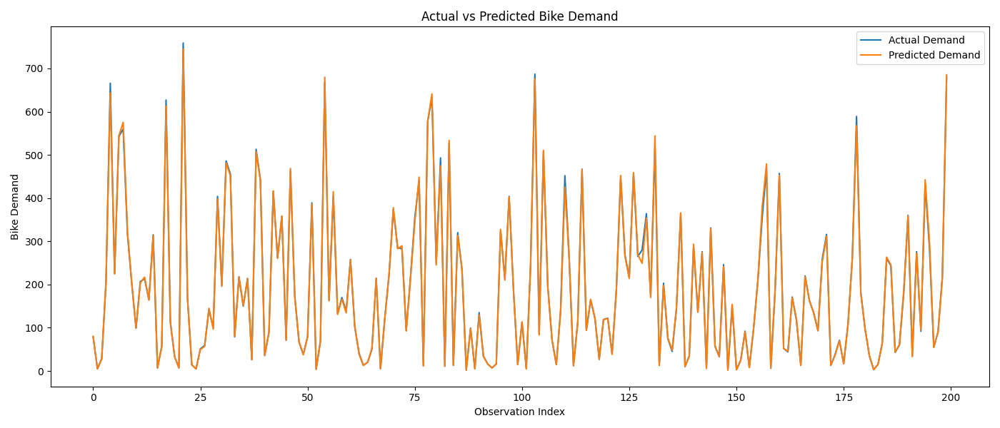
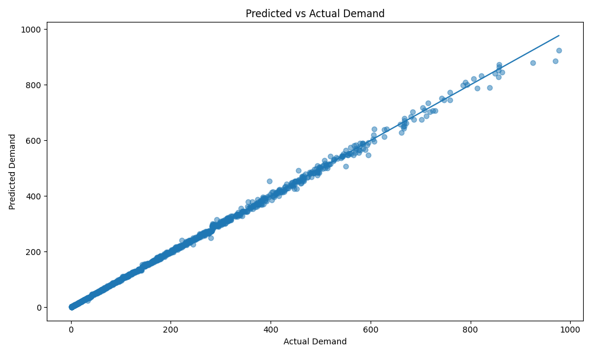
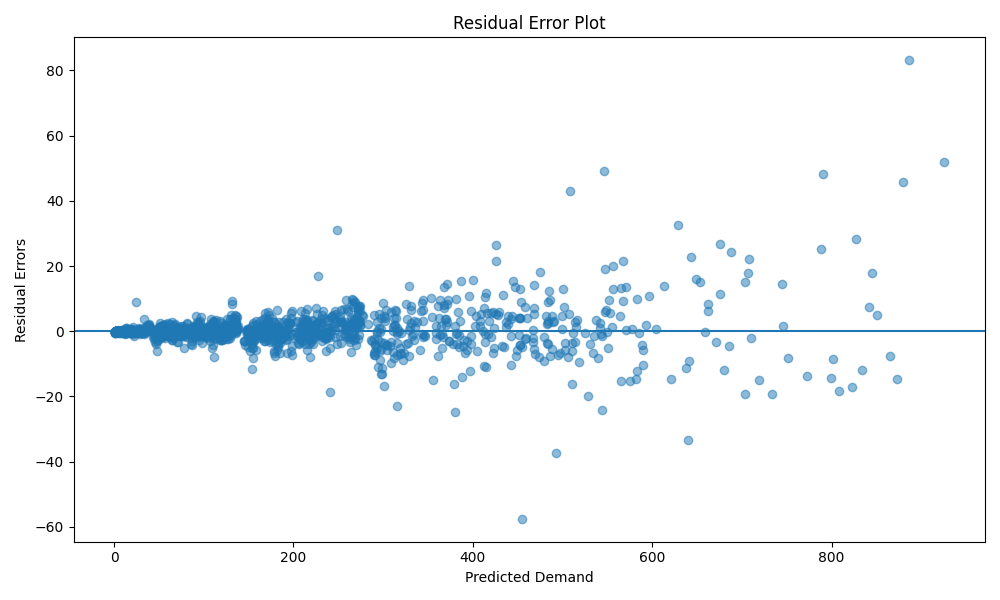

# plot_predictions.py

## Project

```text
Bike_Sharing_Demand_Forecasting
```

---

# Overview

The `plot_predictions.py` script is responsible for generating forecasting prediction visualizations for the Bike Sharing Demand Forecasting project.

This script evaluates and visualizes how well the trained:
```text
XGBoost forecasting model
```

predicts:
```text
hourly bicycle rental demand
```

The script performs:
- actual vs predicted comparison,
- residual error analysis,
- prediction error visualization,
- forecasting performance analysis,
- and business-focused operational forecasting evaluation.

The forecasting target is:

```text
cnt
```

which represents:
```text
Hourly bicycle rental demand
```

These visualizations help businesses:
- understand forecasting quality,
- monitor operational reliability,
- improve logistics planning,
- and validate deployment readiness.

---

# File Location

```text
Bike_Sharing_Demand_Forecasting/
│
├── visualization/
│   └── plot_predictions.py
```

---

# Purpose

The purpose of this script is to:
- visualize forecasting performance,
- compare predictions with actual demand,
- analyze residual errors,
- and support operational forecasting validation.

This script supports:
- forecasting diagnostics,
- business reporting,
- deployment validation,
- and operational planning.

---

# Input Files

The script expects:

## Test Dataset

```text
data/processed/test_dataset.csv
```

---

## Trained Forecasting Model

```text
models/xgboost_model.pkl
```

Generated from:

```bash
python training/train_xgboost.py
```

---

# Output Files

## Prediction Results Dataset

```text
reports/prediction_results.csv
```

---

## Actual vs Predicted Line Plot

```text
graphs/prediction_vs_actual_line.png
```

---

## Prediction Scatter Plot

```text
graphs/prediction_vs_actual_scatter.png
```

---

## Residual Error Plot

```text
graphs/prediction_residual_plot.png
```

---

## Prediction Error Distribution

```text
graphs/prediction_error_distribution.png
```

---

# Workflow

```text
Load Test Dataset
        ↓
Load XGBoost Model
        ↓
Generate Predictions
        ↓
Calculate Forecast Metrics
        ↓
Create Prediction DataFrame
        ↓
Generate Visualization Graphs
        ↓
Save Reports & Plots
```

---

# Key Functionalities

---

# 1. XGBoost Validation

The script validates whether:

```text
xgboost
```

is installed.

If missing:

```bash
pip install xgboost
```

is displayed.

This improves:
- deployment reliability,
- debugging,
- and operational stability.

---

# 2. Required File Validation

The script validates:
- test dataset availability,
- trained model existence,
- and visualization pipeline integrity.

This prevents:
- forecasting failures,
- missing model errors,
- and broken visualization workflows.

---

# 3. Dataset Loading

The script loads:

```text
test_dataset.csv
```

using:

```python
pd.read_csv()
```

This dataset contains:
- unseen operational data,
- and forecasting evaluation records.

---

# 4. Feature & Target Separation

The dataset is divided into:

## Features

```python
X_test
```

## Target Variable

```python
y_test
```

Target:
```text
cnt
```

which represents:
```text
hourly bike demand
```

---

# 5. XGBoost Model Loading

The trained forecasting model is loaded using:

```python
joblib.load()
```

This validates:
- deployment readiness,
- model serialization,
- and operational forecasting compatibility.

---

# 6. Prediction Generation

Predictions are generated using:

```python
model.predict()
```

These predictions estimate:
```text
future hourly bicycle demand
```

---

# Forecasting Concept

Forecasting predicts future demand using:
- historical rental behavior,
- weather conditions,
- seasonal patterns,
- and time-based operational features.

---

# 7. Forecasting Evaluation Metrics

The script calculates:

| Metric | Description |
|---|---|
| MAE | Mean Absolute Error |
| RMSE | Root Mean Squared Error |
| R² | Variance Explained |

---

# MAE Formula

:contentReference[oaicite:0]{index=0}

Measures:
```text
average forecasting error
```

---

# RMSE Formula

:contentReference[oaicite:1]{index=1}

Penalizes:
```text
large forecasting errors
```

---

# R² Formula

:contentReference[oaicite:2]{index=2}

Measures:
```text
how well the forecasting model explains demand variation
```

---

# 8. Prediction Results Dataset

The script generates:

```text
reports/prediction_results.csv
```

Containing:
- actual demand,
- predicted demand,
- prediction error,
- and absolute error.

This supports:
- operational monitoring,
- business reporting,
- and forecasting diagnostics.

---

# 9. Actual vs Predicted Line Plot

The script generates:

```text
graphs/prediction_vs_actual_line.png
```



This graph compares:
- actual bike demand trends,
- and predicted bike demand trends.

---

# Why Line Comparison Matters

This visualization helps businesses:
- evaluate forecasting stability,
- monitor peak-hour accuracy,
- and identify operational forecasting gaps.

---

# 10. Prediction Scatter Plot

The script generates:

```text
graphs/prediction_vs_actual_scatter.png
```


This graph compares:
- actual demand,
- predicted demand.

---

# Ideal Forecast Behavior

Perfect forecasting follows:

:contentReference[oaicite:3]{index=3}

Points close to the diagonal indicate:
```text
high forecasting accuracy
```

---

# 11. Residual Error Plot

The script generates:

```text
graphs/prediction_residual_plot.png
```


Residuals represent:

:contentReference[oaicite:4]{index=4}

This visualization helps identify:
- prediction bias,
- unstable forecasting behavior,
- and operational outliers.

---

# Why Residual Analysis Matters

Good forecasting models produce:
```text
randomly distributed residuals
```

Patterns in residuals may indicate:
- forecasting bias,
- missing variables,
- or operational instability.

---

# 12. Prediction Error Distribution

The script generates:

```text
graphs/prediction_error_distribution.png
```


This histogram visualizes:
```text
the spread of forecasting errors
```

---

# Error Distribution Insights

A centered distribution around zero indicates:
```text
balanced forecasting performance
```

Large spread indicates:
- unstable predictions,
- operational forecasting challenges,
- or peak-demand volatility.

---

# 13. Business Insights

The script automatically displays:
- forecasting observations,
- operational insights,
- and deployment recommendations.

Example insights:
- Peak-hour demand is captured effectively
- Weather strongly influences demand
- Residual errors remain stable

---

# 14. Operational Recommendations

The script recommends:

## Forecast Refresh Frequency

```text
Every 1–3 hours
```

because:
- weather changes rapidly,
- customer behavior fluctuates,
- and operational demand changes dynamically.

---

## Forecast Planning Strategy

Use:
- short-term forecasts for operations,
- seasonal forecasts for staffing,
- and weather-driven forecasting adjustments.

---

# Business Importance

Prediction visualization is critical for:
- operational trust,
- forecasting validation,
- and deployment readiness.

These visualizations help businesses:
- understand model behavior,
- monitor forecasting quality,
- and optimize operational planning.

---

# Why Visualization Matters

Without visualization:
- forecasting errors are difficult to interpret,
- operational weaknesses remain hidden,
- and deployment confidence decreases.

Visualization improves:
- explainability,
- business communication,
- and operational transparency.

---

# Production-Ready Design

The script follows production-quality software engineering practices.

## Maintainability
- modular structure,
- readable formatting,
- descriptive naming.

## Reliability
- validation checks,
- exception handling,
- stable forecasting workflow.

## Scalability
- reusable visualization pipeline,
- dashboard integration support,
- future forecasting expansion.

## Collaboration Friendly
The codebase allows teammates to:
- analyze forecasting quality,
- debug operational issues,
- improve forecasting systems,
- and maintain production pipelines.

---

# Running the Script

From project root:

```bash
python visualization/plot_predictions.py
```

---

# Example Console Output

```text
========================================
 Plotting Forecast Predictions
========================================

Predictions generated successfully.

MAE  : 21.37
RMSE : 31.52
R²   : 0.95

Line comparison plot saved.

Residual plot saved.
```

---

# Why XGBoost Is Suitable

XGBoost is recommended because it:
- captures nonlinear demand behavior,
- handles seasonality effectively,
- models weather dependencies,
- and delivers strong forecasting accuracy.

This makes it highly suitable for:
```text
business operational forecasting
```

---

# Operational Forecasting Impact

Accurate forecasting improves:
- bicycle allocation,
- logistics planning,
- staffing efficiency,
- and customer satisfaction.

This directly supports:
```text
production-grade operational forecasting systems
```

---

# Pipeline Position

```text
feature_engineering/
        ↓
model_training/
        ↓
train_xgboost.py
        ↓
evaluate_models.py
        ↓
plot_predictions.py
        ↓
business_presentation/
        ↓
deployment/
```

---

# Next Recommended Step

After prediction visualization:

```bash
python app/app.py
```

or continue with:
- dashboard development,
- API deployment,
- business presentation creation,
- and production monitoring.

---

# Summary

The `plot_predictions.py` script generates forecasting prediction visualizations for the Bike Sharing Demand Forecasting project using the XGBoost model. It compares actual and predicted bike demand, analyzes residual forecasting errors, creates operational forecasting insights, and supports production-ready deployment validation for business forecasting systems.